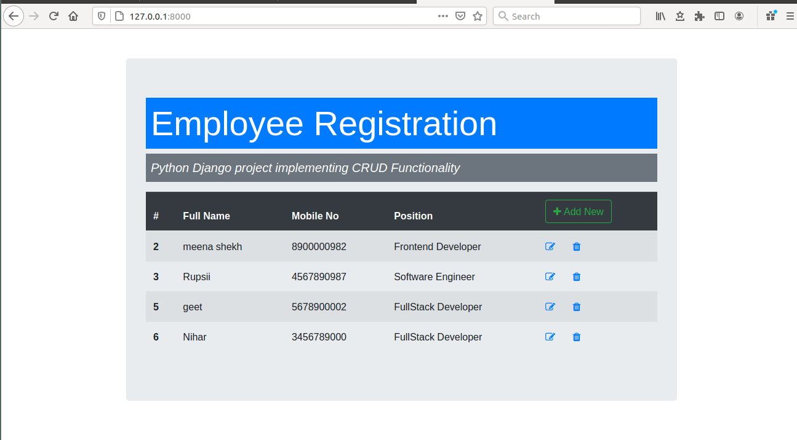
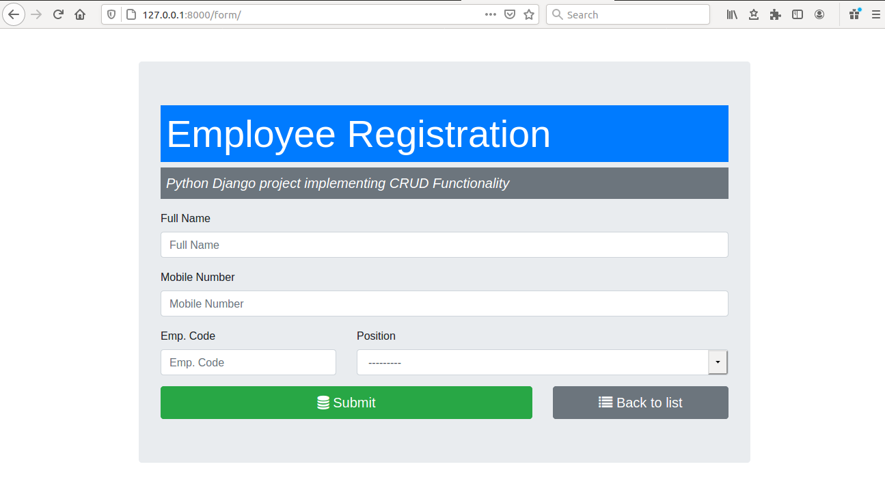

# Employee-Registration
<h2>Python Django project implementing CRUD Functionality</h2>

<ul>
<li>This is a Employee Registration website,which displays all the registered employees.</li>
<li>A new employee can register himself using django forms.</li>
<li>Details of an employee can be updated as well as deleted.</li>
  </ul>

<h2>Requirements</h2>

<ul>
  <li>Python3</li>
  <li>Django2</li></ul>

<h2>Run the application</h2>

Run this command to start the backend server in the [backend] directory: [python3 manage.py runserver] (You have to run this command while you are sourced into the virtual environment)

<h2>Built With</h2>

<ul>
  <li><a href="https://www.python.org/">Python</a> - A programming language that lets you work quickly and integrate systems more effectively.</li>
  <li><a href="https://www.djangoproject.com/">Django</a> - A high-level Python Web framework that encourages rapid development and clean, pragmatic design.</li>

</ul>

